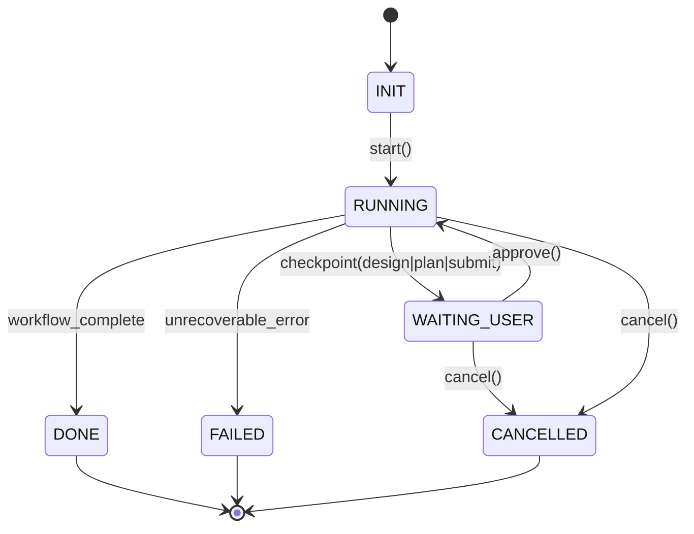
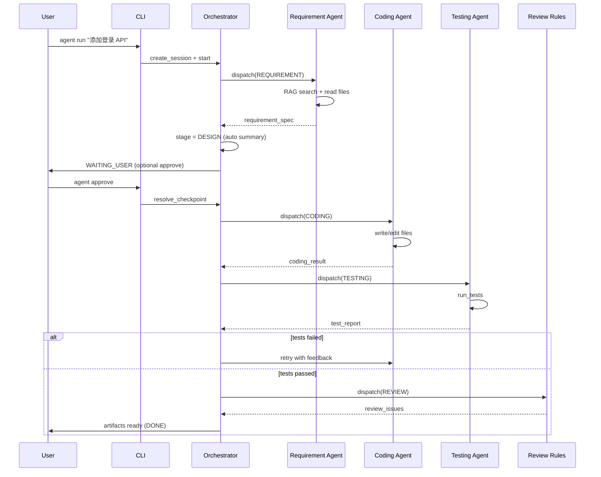
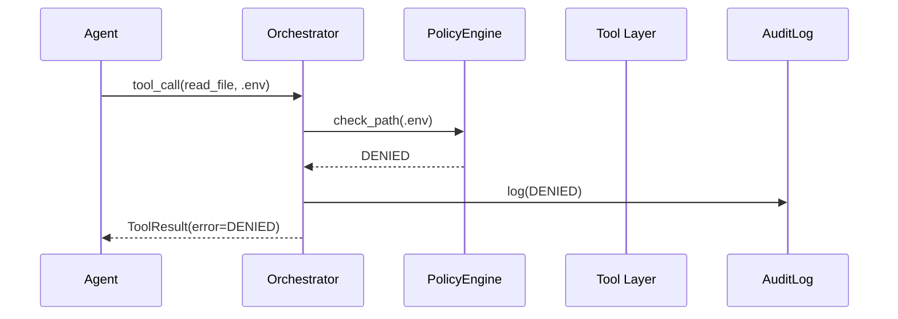

# AI 代码开发 Agent — 架构设计文档

| 文档属性 | 说明 |
|---------|------|
| 项目名称 | AI 代码开发 Agent（智能编程 Copilot） |
| 文档编号 | ARCH-AI-AGENT-001 |
| 文档版本 | v1.0 |
| 编写日期 | 2026-06-27 |
| 文档状态 | 初稿 |
| 关联需求 | SRS-AI-AGENT-001 v2.0 |
| 关联决策 | ADR-001-MVP技术决策.md |

---

## 1. 文档目的与范围

本文档在需求文档 §3 概要架构基础上，给出 **Phase 1 MVP** 的详细设计：组件边界、状态机、数据流、目录结构、接口契约与部署形态。

**Phase 1 范围内：**
- Orchestrator 状态机 + 单模型（可切换）LLM 接入
- 需求理解 / 编码 / 测试 三个 Agent + 规则型 Review
- 基础 Tool：读写文件、终端、跑测试
- 简单 RAG：文件级向量索引
- Session 记忆（SQLite）
- API Key 认证、基础审计、路径/命令黑名单

**Phase 1 范围外（见 Phase 2/3）：** Web UI、OIDC SSO、完整 Review 循环、Checkpoint 恢复、AST chunk、Helm/K8s

---

## 2. 架构原则

| 原则 | 说明 |
|------|------|
| 分层隔离 | Agent 不直接访问 OS；一切通过 Tool Layer |
| 状态机驱动 | Session 生命周期由 Orchestrator 显式状态机管理 |
| 可测试 | 核心逻辑与 LLM 调用可 mock；Tool 可单元测试 |
| 配置外置 | 行为由 `agent.config.yaml` + 环境变量控制 |
| 安全默认拒绝 | 路径/命令黑名单；write 需策略允许 |
| 本地优先 | 数据默认存 `.agent/`，不上云 |

---

## 3. 逻辑架构

```
┌──────────────────────────────────────────────────────────────┐
│  用户交互层                                                    │
│  CLI (Typer)          REST API (FastAPI, 可选 Phase 1 后期)   │
└────────────────────────────┬─────────────────────────────────┘
                             │
┌────────────────────────────▼─────────────────────────────────┐
│  Gateway 层（Phase 1 简化）                                     │
│  API Key 校验 │ 请求审计 │ 速率限制（内存令牌桶）                  │
└────────────────────────────┬─────────────────────────────────┘
                             │
┌────────────────────────────▼─────────────────────────────────┐
│  Orchestrator                                                 │
│  SessionManager │ StateMachine │ TaskPlanner │ PolicyEngine   │
│  AgentDispatcher │ MessageBus │ HumanCheckpoint               │
└───┬─────────┬─────────┬─────────┬────────────────────────────┘
    │         │         │         │
┌───▼───┐ ┌───▼───┐ ┌───▼───┐ ┌───▼────────┐
│ 需求  │ │ 编码  │ │ 测试  │ │ Review     │
│ Agent │ │ Agent │ │ Agent │ │ (规则引擎)  │
└───┬───┘ └───┬───┘ └───┬───┘ └───┬────────┘
    │         │         │         │
    └─────────┴────┬────┴─────────┘
                   │
┌──────────────────▼───────────────────────────────────────────┐
│  能力支撑层                                                     │
│  ToolRegistry │ RAGService │ MemoryStore │ LLMAdapter         │
│  AuditLogger  │ PolicyEngine（路径/命令/角色）                  │
└──────────────────┬───────────────────────────────────────────┘
                   │
┌──────────────────▼───────────────────────────────────────────┐
│  基础设施                                                       │
│  Git 工作区 │ Chroma │ SQLite │ 子进程沙箱终端                  │
└──────────────────────────────────────────────────────────────┘
```

### 3.1 组件职责

| 组件 | 职责 | 禁止 |
|------|------|------|
| **CLI / API** | 解析用户命令，调用 Orchestrator | 包含业务状态机逻辑 |
| **Gateway** | 认证、审计入口、限流 | Agent 调度 |
| **Orchestrator** | 状态流转、Task 调度、人机检查点、策略校验 | 直接读写文件或执行 shell |
| **Agent** | LLM 推理、产出结构化结果、发起 Tool 调用请求 | 绕过 Tool 访问 OS |
| **Tool Layer** | 执行读写/终端/测试；统一返回 `{success, data, error, duration_ms}` | Prompt 管理 |
| **RAG Service** | 建索引、检索、注入上下文 | Session 状态 |
| **Memory Store** | Session、Message、Task、Audit 持久化 | 向量检索 |
| **LLM Adapter** | 统一 chat + function calling 接口 | 业务逻辑 |
| **Policy Engine** | 路径黑名单、命令黑名单、Agent 工具白名单 | LLM 调用 |

---

## 4. Phase 1 状态机

### 4.1 Session 状态（对外）

```
INIT → RUNNING → WAITING_USER → RUNNING → DONE
                  ↓                ↓
               CANCELLED         FAILED
```

| 状态 | 含义 |
|------|------|
| `INIT` | Session 已创建，尚未开始 |
| `RUNNING` | Orchestrator 正在驱动 Agent 执行 |
| `WAITING_USER` | 等待用户确认（设计摘要 / 变更计划 / 最终提交） |
| `DONE` | 流程成功结束 |
| `FAILED` | 不可恢复失败或超过重试上限 |
| `CANCELLED` | 用户主动取消 |

### 4.2 工作流阶段（对内 workflow_stage）

```
REQUIREMENT → DESIGN → CODING → TESTING → REVIEW → SUBMIT
     ↑            │         ↑         │
     └────────────┴─────────┴─────────┘  （失败回退，记录 reason）
```

| 转换 | 触发条件 |
|------|---------|
| REQUIREMENT → DESIGN | 需求理解 Agent 输出结构化规格且无 blocking 歧义（或用户已澄清） |
| DESIGN → CODING | 设计摘要已产出；若 `require_plan_approval=true` 则需用户 approve |
| CODING → TESTING | 编码 Agent 完成变更计划执行 |
| TESTING → REVIEW | 测试全通过（或达 max_retries 仍失败 → FAILED） |
| TESTING → CODING | 测试失败，反馈根因给编码 Agent（MAC-002） |
| REVIEW → SUBMIT | 规则 Review 无 blocking |
| REVIEW → CODING | blocking 问题（Phase 2：LLM Review 修复循环） |
| SUBMIT → DONE | 用户 approve 或仅导出 artifacts（默认不 auto-commit） |

### 4.3 状态机图



---

## 5. Agent 设计

### 5.1 Agent 公共接口

```python
class AgentContext:
    session_id: str
    task: Task
    workspace: Path
    rag_chunks: list[RAGChunk]
    memory_summary: str
    prior_messages: list[Message]  # 截断至 token 预算

class AgentResult:
    success: bool
    output: dict          # 各 Agent 定义的 JSON schema
    tool_calls: list[ToolCallRecord]
    tokens_used: int
    error: str | None
```

每个 Agent 实现 `async def run(ctx: AgentContext) -> AgentResult`。

### 5.2 各 Agent 职责与工具白名单

| Agent | 可用 Tools | 输出 Schema 要点 |
|-------|-----------|-----------------|
| **Requirement** | read_file, list_dir, glob_search, grep, RAG search | summary, acceptance_criteria, related_files, open_questions, tasks[] |
| **Coding** | read_file, write_file, edit_file, list_dir, grep, RAG search | change_plan[], files_changed[], changelog |
| **Testing** | read_file, run_tests, run_terminal_cmd（测试相关） | report: passed/failed/skipped, failures[], suggestion |
| **Review（规则）** | read_file, grep（只读） | issues[]: level(blocking/suggestion/nit), file, message |

> Phase 1 Review 不调用 LLM，执行：密钥正则扫描、Linter error 检查、变更文件数/行数阈值告警。

### 5.3 Agent 间消息总线

Orchestrator 维护 **结构化上下文包**，每次 dispatch 只传递：

```json
{
  "requirement_spec": { "...": "来自 Requirement Agent" },
  "design_summary": { "...": "可选" },
  "coding_result": { "files_changed": [], "changelog": "" },
  "test_report": { "passed": 10, "failed": 0 },
  "review_issues": []
}
```

不将完整历史 Prompt 链传递给下一 Agent（MAC-003）；完整历史存 Memory Store，按需摘要。

---

## 6. Tool Layer 设计

### 6.1 工具注册

```python
@dataclass
class ToolDefinition:
    name: str
    description: str
    parameters: dict          # JSON Schema
    handler: Callable
    allowed_agents: set[str]
    requires_approval: bool   # 如 git commit
```

Phase 1 内置工具：

| 工具 | 需求 ID | 说明 |
|------|--------|------|
| `read_file` | TC-001 | path, start_line?, end_line? |
| `write_file` | TC-002 | path, content, dry_run? |
| `edit_file` | TC-003 | path, old_string, new_string |
| `list_dir` | TC-004 | path, recursive? |
| `glob_search` | TC-004 | pattern |
| `grep` | TC-005 | pattern, path?, glob? |
| `run_terminal_cmd` | TC-010~012 | command, cwd? |
| `run_tests` | TC-020 | scope? (all/changed) |

### 6.2 工具执行流水线

```
Agent 请求 ToolCall
    → PolicyEngine.check_path / check_command / check_agent_permission
    → 拒绝则返回 { success: false, error: "DENIED", ... } + 写 AuditLog
    → 通过则执行 handler（带 timeout）
    → 封装 ToolResult + AuditLog
    → 返回 Agent
```

### 6.3 安全策略（Phase 1）

**路径黑名单（默认）：**
- `**/.env`, `**/.env.*`
- `**/secrets/**`
- `~/.ssh/**`
- 工作区外路径（目录遍历防护，NFR-S03）

**命令黑名单（默认）：**
- `rm -rf /`, `rm -rf /*`
- `git push --force`
- `format`, `mkfs`, `dd if=`

**Agent 写权限：**
- Requirement / Testing / Review：**只读**
- Coding：**可写** workspace 内非黑名单路径

---

## 7. RAG 设计（Phase 1 简化版）

### 7.1 索引策略

Phase 1 采用 **文件级 chunk**（整文件或按 800 token 滑动窗口切分，不做 AST）：

1. 遍历 workspace，respect `.gitignore` + config `rag.exclude`
2. 对每个文件生成 embedding（`text-embedding-3-small`）
3. 存入 Chroma collection：`{workspace_hash}_code`

元数据：`path`, `language`, `start_line`, `end_line`, `content_hash`

### 7.2 检索流程

```
Task 描述 / 用户 query
    → 生成 1~3 条 retrieval query（Requirement Agent 或 RAGService）
    → 向量 Top-K（K=10）
    → 按 relevance 截断至 token 预算（RAG-014）
    → 注入 AgentContext.rag_chunks
```

Phase 2 增加：BM25 混合检索、符号引用扩展（RAG-010~013）。

### 7.3 索引命令

```bash
agent index [--force]    # CLI 子命令，重建索引
```

---

## 8. Memory Store 设计

### 8.1 存储选型

Phase 1：**SQLite** 单文件 `{workspace}/.agent/sessions/agent.db`

Phase 2 迁移 PostgreSQL（NFR-C04）。

### 8.2 核心表

```sql
-- sessions
CREATE TABLE sessions (
    id TEXT PRIMARY KEY,
    user_id TEXT NOT NULL,
    org_id TEXT,                    -- Phase 1 可为 NULL
    repo_path TEXT NOT NULL,
    branch TEXT,
    status TEXT NOT NULL,
    workflow_stage TEXT,
    created_at TEXT NOT NULL,
    updated_at TEXT NOT NULL,
    metadata JSON
);

-- tasks
CREATE TABLE tasks (
    id TEXT PRIMARY KEY,
    session_id TEXT NOT NULL,
    title TEXT,
    description TEXT,
    status TEXT,
    depends_on JSON,
    sort_order INTEGER,
    FOREIGN KEY (session_id) REFERENCES sessions(id)
);

-- messages
CREATE TABLE messages (
    id TEXT PRIMARY KEY,
    session_id TEXT NOT NULL,
    role TEXT NOT NULL,             -- user | agent | tool | system
    agent_name TEXT,
    content TEXT,
    structured_output JSON,
    created_at TEXT NOT NULL,
    FOREIGN KEY (session_id) REFERENCES sessions(id)
);

-- file_changes
CREATE TABLE file_changes (
    id TEXT PRIMARY KEY,
    session_id TEXT NOT NULL,
    task_id TEXT,
    file_path TEXT NOT NULL,
    diff TEXT,
    agent_name TEXT,
    created_at TEXT NOT NULL
);

-- audit_logs
CREATE TABLE audit_logs (
    id TEXT PRIMARY KEY,
    timestamp TEXT NOT NULL,
    actor_id TEXT,
    action TEXT NOT NULL,
    resource_type TEXT,
    resource_id TEXT,
    result TEXT NOT NULL,           -- SUCCESS | DENIED | FAILED
    metadata JSON
);

-- memory_entries
CREATE TABLE memory_entries (
    id TEXT PRIMARY KEY,
    session_id TEXT NOT NULL,
    type TEXT NOT NULL,             -- DECISION | PREFERENCE | SUMMARY | FACT
    content TEXT NOT NULL,
    superseded_by TEXT,
    created_at TEXT NOT NULL
);
```

---

## 9. LLM Adapter 设计

### 9.1 接口

```python
class LLMAdapter(Protocol):
    async def chat(
        self,
        messages: list[dict],
        tools: list[ToolDefinition] | None = None,
        response_format: dict | None = None,
    ) -> LLMResponse: ...

class LLMResponse:
    content: str | None
    tool_calls: list[ToolCall]
    usage: TokenUsage
```

### 9.2 实现

| Provider | 类名 | Phase | 说明 |
|----------|------|-------|------|
| Anthropic 兼容 | `AnthropicAdapter` | P0（默认） | 支持 `base_url` 指向 DeepSeek（`https://api.deepseek.com/anthropic`） |
| OpenAI 兼容 | `OpenAIAdapter` | P0 | 支持 `base_url` 指向 DeepSeek（`https://api.deepseek.com`） |
| Ollama | `OllamaAdapter` | P1 可选 | 本地离线降级 |

**DeepSeek V4 模型 ID（官方）：**
- `deepseek-v4-pro` — Agent 主流程推荐
- `deepseek-v4-flash` — 轻量 / 高并发

> 若通过 Anthropic 兼容端点并使用 `claude-sonnet-*` 等 Claude 模型名，DeepSeek 会自动路由到 V4-Flash/Pro；建议显式使用 `deepseek-v4-pro` 以避免歧义。

### 9.3 配置示例（DeepSeek V4）

```yaml
llm:
  provider: "anthropic"                              # 或 "openai"
  base_url: "https://api.deepseek.com/anthropic"   # OpenAI 方式则 https://api.deepseek.com
  model: "deepseek-v4-pro"
  api_key_env: "DEEPSEEK_API_KEY"                  # 从环境变量读取，禁止写入配置文件
  max_tokens_per_run: 100000
```

### 9.4 重试与降级

- 失败指数退避，最多 3 次（NFR-R01）
- 主 provider 不可用时尝试 fallback provider（Phase 2）

---

## 10. 项目目录结构

```
AI代码开发Agent/
├── pyproject.toml
├── agent.config.yaml.example
├── README.md
├── docs/
│   ├── 需求文档-AI代码开发Agent.md
│   ├── 架构设计文档-AI代码开发Agent.md
│   └── ADR-001-MVP技术决策.md
├── src/
│   └── agent/
│       ├── __init__.py
│       ├── cli/                 # Typer CLI 入口
│       │   └── main.py
│       ├── api/                 # FastAPI（Phase 1 后期）
│       │   └── app.py
│       ├── orchestrator/
│       │   ├── session_manager.py
│       │   ├── state_machine.py
│       │   ├── dispatcher.py
│       │   └── planner.py
│       ├── agents/
│       │   ├── base.py
│       │   ├── requirement.py
│       │   ├── coding.py
│       │   ├── testing.py
│       │   └── review_rules.py
│       ├── tools/
│       │   ├── registry.py
│       │   ├── file_tools.py
│       │   ├── terminal_tools.py
│       │   └── test_tools.py
│       ├── rag/
│       │   ├── indexer.py
│       │   └── retriever.py
│       ├── memory/
│       │   ├── store.py
│       │   └── models.py
│       ├── security/
│       │   ├── policy.py
│       │   └── audit.py
│       ├── llm/
│       │   ├── adapter.py
│       │   ├── anthropic_adapter.py
│       │   └── openai_adapter.py
│       └── config/
│           └── loader.py
├── tests/
│   ├── unit/
│   └── integration/
└── examples/
    └── sample-repo/             # E2E 用示例仓库
```

---

## 11. CLI 与 API 映射

### 11.1 CLI 命令（Phase 1）

| 命令 | Orchestrator 操作 |
|------|------------------|
| `agent run "<desc>"` | create_session + start_workflow |
| `agent continue -s ID "<msg>"` | append_message + resume |
| `agent status -s ID` | get_session_summary |
| `agent diff -s ID` | get_cumulative_diff |
| `agent approve -s ID` | resolve_checkpoint |
| `agent cancel -s ID` | cancel_session |
| `agent sessions list` | list_sessions |
| `agent index` | rag.rebuild_index |

### 11.2 REST API（Phase 1 后期，与 §6.4 对齐）

| 端点 | 对应 CLI |
|------|---------|
| `POST /v1/sessions` | run |
| `GET /v1/sessions/{id}` | status |
| `POST /v1/sessions/{id}/messages` | continue |
| `POST /v1/sessions/{id}/approve` | approve |
| `POST /v1/sessions/{id}/cancel` | cancel |
| `GET /v1/health` | — |

---

## 12. 关键序列图

### 12.1 标准开发流程



### 12.2 Tool 调用（含策略拦截）



---

## 13. 配置

沿用需求文档 §6.3 的 `agent.config.yaml` 结构；Phase 1 必填项：

```yaml
workspace: "."
llm:
  provider: "anthropic"
  base_url: "https://api.deepseek.com/anthropic"
  model: "deepseek-v4-pro"
  max_tokens_per_run: 100000
agents:
  coding:
    max_retries: 3
    require_plan_approval: true
tools:
  terminal:
    timeout_seconds: 120
    blocked_commands: ["rm -rf", "git push --force"]
rag:
  index_path: ".agent/index"
  exclude: ["node_modules", "dist", ".git"]
memory:
  persist_path: ".agent/sessions"
security:
  secret_patterns: ["*.env", "**/secrets/**"]
  path_denylist: ["/etc"]
audit:
  retention_days: 90
```

---

## 14. 部署架构（Phase 1）

| 模式 | 组件 | 说明 |
|------|------|------|
| **本地开发** | CLI + SQLite + Chroma 嵌入式 | 默认模式 |
| **Docker** | 单容器：CLI/API + 卷挂载 workspace | `docker compose up` |

```
┌─────────────────────────────────────┐
│  Docker Host                         │
│  ┌───────────────────────────────┐  │
│  │  agent container               │  │
│  │  CLI / FastAPI                 │  │
│  │  SQLite + Chroma (volume)      │  │
│  └───────────┬───────────────────┘  │
│              │ bind mount            │
│  ┌───────────▼───────────────────┐  │
│  │  /workspace (用户 Git 仓库)     │  │
│  │  .agent/ (sessions, index)    │  │
│  └───────────────────────────────┘  │
└─────────────────────────────────────┘
```

K8s / Helm 留 Phase 2。

---

## 15. 可观测性（Phase 1 最小集）

| 能力 | 实现 |
|------|------|
| 结构化日志 | `structlog`，字段：session_id, agent, tool, duration_ms |
| Token 统计 | 每次 LLM 调用写入 messages 元数据 |
| Session 回放 | 导出 JSON（messages + audit + file_changes） |
| 指标 | Phase 2 OpenTelemetry |

---

## 16. Phase 1 实现顺序

与需求 §11 对齐，按依赖排序：

| 步骤 | 模块 | 产出 | E2E |
|------|------|------|-----|
| **S1** | 项目骨架 + Config + Memory Store | 可启动的空 CLI | — |
| **S2** | Tool Layer + PolicyEngine + Audit | 工具单元测试 | E2E-05 |
| **S3** | Orchestrator 状态机 + SessionManager | 状态流转测试 | E2E-04 |
| **S4** | LLM Adapter + Requirement Agent | 结构化需求输出 | — |
| **S5** | RAG Indexer + Retriever | `agent index` | — |
| **S6** | Coding Agent | 多文件编辑 | — |
| **S7** | Testing Agent + Review Rules | 测试报告 + 密钥扫描 | E2E-01 |
| **S8** | CLI 全流程联调 | Demo 可跑通 | E2E-01/04/05 |

---

## 17. 风险与缓解（架构视角）

| 风险 | 缓解 |
|------|------|
| LLM 输出不稳定 | 结构化 output + JSON schema 校验 + 重试 |
| Token 超限 | RAG 截断 + 消息摘要 + 分 Task |
| 半写入损坏 | Tool 层事务性（先 dry_run）+ cancel 时 reconcile git status |
| Windows 路径 | 统一 `pathlib.Path` 规范化 |

---

## 18. 待编写文档

| 文档 | 依赖本文 | 计划步骤 |
|------|---------|---------|
| 接口规范 | §11 | **下一步 S1 后** |
| 测试策略 | §16 | S2 开始前 |
| 安全设计 | §6.3 | S2 并行 |
| 运维手册 | §14 | S8 前 |

---

## 19. 修订记录

| 版本 | 日期 | 说明 |
|------|------|------|
| v1.0 | 2026-06-27 | 初稿，覆盖 Phase 1 MVP |

---

*本文档对应需求 SRS-AI-AGENT-001 v2.0 Phase 1 范围；技术决策见 ADR-001。*
